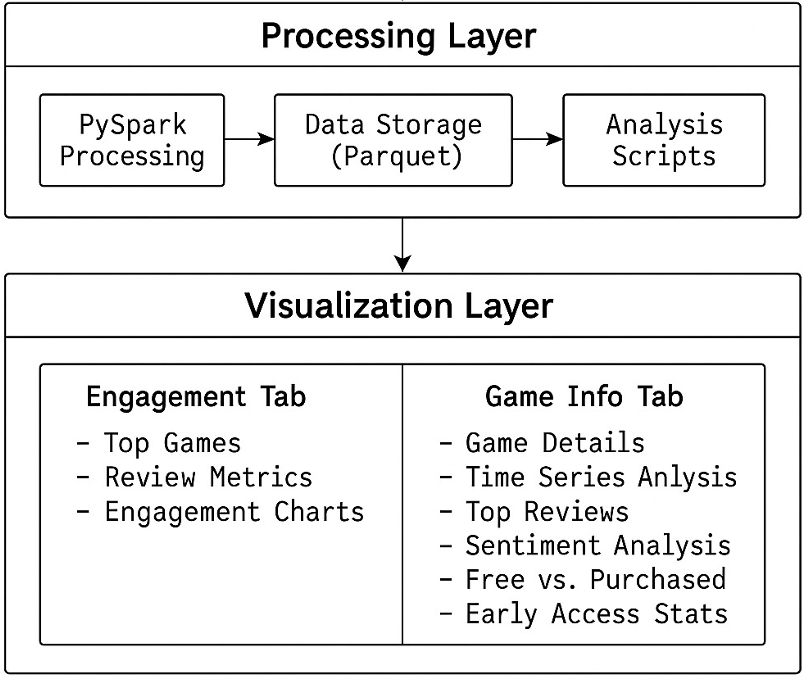

# Steam Game Reviews Analysis - Big Data Analytics Platform

A **large-scale big data analytics workflow**, designed to process and analyze **113 million Steam game reviews** using distributed computing technologies. This enterprise-grade solution demonstrates advanced big data engineering principles, handling massive dataset that span **43GB in raw CSV format**, processing them down to **109 million optimized records in 18GB Parquet format** through sophisticated ETL pipelines and **snappy compression technique**.

## 🎯 Big Data Project Overview

This project showcases a **big data analytics solution** built on Apache Spark's distributed computing framework, which demonstrates advanced distributed processing and real-time analytics on steam review dataset containing over **100 million records**.

### **Big Data Technical Implementation & Achievements**
- **Volume Processing**: **113 million Steam reviews** (43GB raw data) on a device with **1GB cache memory** and **10GB RAM**
- **Storage Optimization**: **58% storage reduction** (43GB → 18GB) through **Snappy compression**
- **In-Memory Computing**: **Strategic data caching** for dashboard's performance optimization
- **Memory Management**: Processing datasets **larger than available RAM**
- **Machine Learning at Scale**: **Batch processing** of sentiment analysis on millions of text records
- **Multi-structured Data**: Text reviews, numerical metrics, timestamps, categorical and boolean data
- **ETL Pipelines**: Large-scale **data transformation** and **cleaning workflows**
- **Columnar Storage**: **Parquet format** with advanced compression for analytical workloads

## 🏗️ Architecture & Technologies

### System Architecture



The system follows a layered architecture approach with clear separation of concerns:

#### **Processing Layer**
- **PySpark Processing**: Distributed data processing using Apache Spark for handling large-scale Steam review datasets
- **Data Storage (Parquet)**: Efficient columnar storage format optimized for analytical queries and compression
- **Analysis Scripts**: Modular analytics components for different types of data analysis

#### **Visualization Layer / Dashboard Features**
- **Engagement Tab**: 
  - Top Games analysis by review volume
  - Review Metrics and user engagement statistics
  - Engagement Charts with interactive visualizations
- **Game Info Tab**:
  - Game Details and metadata analysis
  - Time Series Analysis of review patterns
  - Top Reviews identification and ranking
  - Sentiment Analysis using AI/ML models
  - Free vs. Purchased game acquisition analysis
  - Early Access Stats and trends


### Core Technologies Stack

#### **Big Data Processing**
- **Apache Spark 3.4+**: Distributed data processing engine for handling large datasets
- **PySpark**: Python API for Spark, enabling scalable data transformations and analytics
- **PyArrow 12.0+**: High-performance columnar data processing
- **Parquet Format**: Efficient columnar storage for optimized query performance

#### **Web Application Framework: Streamlit & Python**


#### **Data Visualization:  Altair, Plotly & NumPy**

#### **Machine Learning & AI**
- **Transformers 4.35.0**: Hugging Face library for NLP models
- **PyTorch 2.0+**: Deep learning framework for sentiment analysis
- **DistilBERT**: Pre-trained transformer model for sentiment classification


## 📊 Data Pre-processing

### Data Processing Pipeline

1. **Data Ingestion**: Load pre-processed Parquet files using Spark
2. **Schema Validation**: Verify data structure and types
3. **Data Cleaning**: 
   - Remove null/empty values
   - Convert Unix timestamps to datetime
   - Cast columns to appropriate types
   - Drop unnecessary columns
4. **Data Optimization**: 
   - Apply Snappy compression
   - Coalesce partitions for optimal storage
   - Create indexed structures for fast queries


### Core Data Fields
```python
# Review Data Schema
{
    "game": "string",                    # Game title
    "author_steamid": "string",          # Unique reviewer identifier
    "review": "string",                  # Review text content
    "timestamp_created": "timestamp",    # Review creation date
    "timestamp_updated": "timestamp",    # Last modification date
    "votes_up": "integer",              # Helpful votes received
    "votes_funny": "integer",           # Funny votes received
    "comment_count": "integer",         # Number of comments
    "steam_purchase": "boolean",        # Purchased through Steam
    "received_for_free": "boolean",     # Received as free copy
    "written_during_early_access": "boolean",  # Early access review
    "author_playtime_forever": "integer",      # Total playtime
    "author_playtime_at_review": "integer",   # Playtime when reviewed
    "language": "string",               # Review language
    "weighted_vote_score": "float"      # Steam's weighted score
}
```


## 🛠️ Implementation Details

### Spark Configuration
```python
# Optimized Spark session for large datasets
SparkSession.builder \
    .appName("SteamReviewsAnalysis") \
    .master("local[4]") \
    .config("spark.driver.memory", "8g") \
    .config("spark.sql.adaptive.enabled", "true") \
    .getOrCreate()
```

### Sentiment Analysis Pipeline
```python
# DistilBERT-based sentiment classification
model = AutoModelForSequenceClassification.from_pretrained(
    "distilbert-base-uncased-finetuned-sst-2-english"
)
# Batch processing for efficiency
# Confidence-weighted aggregation
# Real-time sentiment scoring
```

### Performance Optimizations
- **Data Caching**: Strategic caching of frequently accessed datasets --> For Dashboard Filtering
- **Batch Processing**: Efficient batch processing for ML operations --> Using top 1k filtered record on dashboard for lightweight inference


### Installation

1. **Clone the repository**
```bash
git clone <repository-url>
cd BigData_Project
```

2. **Install dependencies**
```bash
pip install -r requirements.txt
```

3. **Prepare the dataset**
```bash
# Run data cleaning pipeline
python books_and_scripts/clean_parquet.py
```

4. **Launch the application**
```bash
python -m streamlit run src/streamlit_app.py
```

### Usage

1. **Access the dashboard** at `http://localhost:8501`
2. **Select analysis type** using the tab navigation
3. **Configure filters** (date range, game selection, language)
4. **Run analysis** and explore interactive visualizations
5. **Export results** for further analysis

## 🔧 Configuration

### Spark Settings
Modify `src/utils/spark_session.py` to adjust:
- Memory allocation
- Number of cores
- Cluster configuration

### Data Paths
Update file paths in:
- `src/tabs/engagement_tab/ui.py`
- `books_and_scripts/clean_parquet.py`

## 🤝 Contributing

1. Fork the repository
2. Create a feature branch
3. Implement changes with tests
4. Submit a pull request

## 📄 License

This project is licensed under the MIT License - see the LICENSE file for details.

## Acknowledgments

- Steam for providing the review data
- Apache Spark community for the big data framework
- Hugging Face for pre-trained NLP models
- Streamlit team for the web framework 